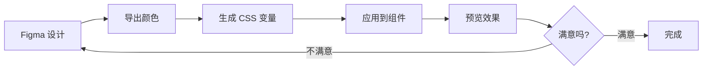

# 主题定制 - 使用 Figma 设计系统

## 什么是主题定制？

主题定制就像给你的房子装修，可以改变：
- 🎨 **颜色**：主色调、辅助色、背景色
- 📝 **字体**：字体类型、大小、行距
- 📐 **布局**：间距、边框、圆角
- ✨ **效果**：阴影、动画、渐变

## Figma 设计系统介绍

### 什么是 Figma？
Figma 是一个在线设计工具，我们可以用它：
- 🎨 设计界面和组件
- 📋 管理颜色系统
- 🤝 与团队协作
- 🔄 导出设计规范

### 访问我们的设计系统

1. 打开 Figma：[figma.com](https://figma.com)
2. 登录你的账号
3. 打开设计文件（项目提供的）

## 颜色系统详解

### 主色调（Primary Color）
网站的主要颜色，用于：
- 按钮
- 链接
- 重要元素

### 辅助色（Secondary Color）
配合主色调使用，用于：
- 次要按钮
- 背景装饰
- 状态指示

### 中性色（Neutral Colors）
灰色系列，用于：
- 文字
- 边框
- 背景

### 语义色（Semantic Colors）
- 🟢 成功（Success）
- 🔵 信息（Info）
- 🟡 警告（Warning）
- 🔴 错误（Error）

## Figma 中的颜色系统

### 查看颜色规范

1. 在 Figma 中找到 "Colors" 页面
2. 你会看到类似这样的颜色板：

```
主色调
├─ Primary-50   #E3F2FD  (最浅)
├─ Primary-100  #BBDEFB
├─ Primary-500  #2196F3  (主色)
├─ Primary-700  #1976D2
└─ Primary-900  #0D47A1  (最深)

辅助色
├─ Secondary-50   #F3E5F5
├─ Secondary-500  #9C27B0
└─ Secondary-900  #4A148C

中性色
├─ Gray-50   #FAFAFA  (背景)
├─ Gray-100  #F5F5F5
├─ Gray-300  #E0E0E0  (边框)
├─ Gray-600  #757575  (次要文字)
├─ Gray-800  #424242  (主要文字)
└─ Gray-900  #212121  (标题)
```

### 导出颜色代码

1. 点击想要的颜色
2. 在右侧属性面板复制颜色值（如 #2196F3）
3. 或者使用快捷键：`Ctrl/Cmd + C`

## 在代码中应用颜色

### 找到颜色变量文件

通常位于：
```
src/
├── styles/
│   ├── variables.css    # CSS 变量
│   ├── colors.scss      # SCSS 颜色变量
│   └── theme.js         # JavaScript 主题配置
```

### 修改 CSS 变量（推荐）

```css
/* styles/variables.css */
:root {
  /* 主色调 */
  --color-primary-50: #E3F2FD;
  --color-primary-100: #BBDEFB;
  --color-primary-500: #2196F3;  /* 主色 */
  --color-primary-700: #1976D2;
  --color-primary-900: #0D47A1;

  /* 辅助色 */
  --color-secondary-50: #F3E5F5;
  --color-secondary-500: #9C27B0;
  --color-secondary-900: #4A148C;

  /* 中性色 */
  --color-gray-50: #FAFAFA;
  --color-gray-100: #F5F5F5;
  --color-gray-300: #E0E0E0;
  --color-gray-600: #757575;
  --color-gray-800: #424242;
  --color-gray-900: #212121;

  /* 语义色 */
  --color-success: #4CAF50;
  --color-info: #2196F3;
  --color-warning: #FF9800;
  --color-error: #F44336;

  /* 文字颜色 */
  --text-primary: var(--color-gray-900);
  --text-secondary: var(--color-gray-600);
  --text-disabled: var(--color-gray-400);

  /* 背景颜色 */
  --bg-primary: #FFFFFF;
  --bg-secondary: var(--color-gray-50);
  --bg-tertiary: var(--color-gray-100);
}
```

### 使用 AI 助手修改主题

**需求描述：**
```
"我想把网站的主题色从蓝色改成绿色，
我在 Figma 里选好了颜色：#4CAF50，
请帮我更新所有的颜色变量"
```

**AI 会帮你：**
```css
/* AI 生成的新颜色系统 */
:root {
  /* 新的主色调（基于 #4CAF50） */
  --color-primary-50: #E8F5E9;
  --color-primary-100: #C8E6C9;
  --color-primary-500: #4CAF50;  /* 新的主色 */
  --color-primary-700: #388E3C;
  --color-primary-900: #1B5E20;

  /* 自动生成和谐的辅助色 */
  --color-secondary-50: #E0F2F1;
  --color-secondary-500: #009688;
  --color-secondary-900: #004D40;

  /* 其他颜色保持不变... */
}
```

## 实战：完整主题定制

### 第一步：分析 Figma 设计

1. 打开 Figma 设计文件
2. 记录主要颜色：
   - 主色：#667eea
   - 辅助色：#764ba2
   - 成功色：#10b981
   - 警告色：#f59e0b
   - 错误色：#ef4444

### 第二步：让 AI 生成主题

**完整需求描述：**
```
"根据以下 Figma 设计规范，帮我生成完整的主题系统：

主色：#667eea
辅助色：#764ba2
成功色：#10b981
警告色：#f59e0b
错误色：#ef4444

要求：
1. 使用 CSS 变量
2. 每个主色包含 50-900 共 10 个色阶
3. 包含文字颜色、背景颜色
4. 包含暗黑模式支持"
```

### 第三步：应用主题到组件

**按钮组件示例：**
```css
/* 主要按钮 */
.btn-primary {
  background-color: var(--color-primary-500);
  color: white;
  border: none;
  padding: 12px 24px;
  border-radius: 6px;
  font-weight: 500;
  cursor: pointer;
  transition: all 0.2s ease;
}

.btn-primary:hover {
  background-color: var(--color-primary-600);
  transform: translateY(-1px);
  box-shadow: 0 4px 12px rgba(var(--color-primary-rgb), 0.3);
}

/* 次要按钮 */
.btn-secondary {
  background-color: var(--color-secondary-500);
  color: white;
  /* 其他样式... */
}

/* 轮廓按钮 */
.btn-outline {
  background-color: transparent;
  color: var(--color-primary-500);
  border: 2px solid var(--color-primary-500);
}

.btn-outline:hover {
  background-color: var(--color-primary-500);
  color: white;
}
```

## 高级主题功能

### 1. 暗黑模式

```css
/* 暗黑模式变量 */
@media (prefers-color-scheme: dark) {
  :root {
    --text-primary: #ffffff;
    --text-secondary: #a1a1aa;
    --bg-primary: #18181b;
    --bg-secondary: #27272a;
    --bg-tertiary: #3f3f46;

    /* 调整颜色饱和度 */
    --color-primary-500: #818cf8;
    --color-secondary-500: #a78bfa;
  }
}

/* 手动切换暗黑模式 */
[data-theme="dark"] {
  --text-primary: #ffffff;
  --text-secondary: #a1a1aa;
  --bg-primary: #18181b;
  /* 其他暗黑变量... */
}
```

### 2. 主题切换器

**让 AI 帮你创建：**
```
"帮我创建一个主题切换按钮，可以在亮色和暗色主题之间切换"
```

### 3. 动态主题色

```javascript
// theme.js
function updateThemeColor(primaryColor) {
  // 生成颜色梯度
  const colors = generateColorPalette(primaryColor);

  // 更新 CSS 变量
  document.documentElement.style.setProperty('--color-primary-500', primaryColor);
  document.documentElement.style.setProperty('--color-primary-600', colors.dark);
  document.documentElement.style.setProperty('--color-primary-400', colors.light);
}
```

## Figma 到代码的工作流程

### 1. 设计 → 开发流程



### 2. 团队协作

**设计师职责：**
- 在 Figma 中维护设计系统
- 标注清楚所有颜色值
- 提供组件使用规范

**开发者职责：**
- 准确实现颜色变量
- 确保一致性应用
- 反馈实现中的问题

## 常见主题问题

### 问题 1：颜色不协调

**AI 解决方案：**
```
"这些颜色搭配起来不好看，能帮我调整一下，
让整体更和谐吗？"
```

### 问题 2：对比度不够

**AI 会检查：**
```css
/* 确保足够的对比度 */
.text-on-primary {
  color: white; /* 在主色背景上用白色文字 */
}

/* AI 会建议使用工具检查对比度 */
```

### 问题 3：浏览器兼容性

**解决方案：**
```css
/* 使用 CSS 变量的降级方案 */
.button {
  background-color: #667eea; /* 备用颜色 */
  background-color: var(--color-primary-500);
}
```

## 实战练习

### 练习 1：创建个人主题

**任务：**
1. 在 Figma 中选择你喜欢的颜色
2. 让 AI 帮你生成完整的主题系统
3. 应用到你的网站上

### 练习 2：添加主题切换

**任务：**
1. 创建亮色/暗色两种主题
2. 添加切换按钮
3. 保存用户偏好

### 练习 3：动态主题生成

**任务：**
1. 让用户可以选择主色调
2. 自动生成完整的颜色系统
3. 实时预览效果

## 主题工具推荐

### 在线工具
- [Coolors.co](https://coolors.co) - 配色方案生成
- [Adobe Color](https://color.adobe.com) - 颜色理论工具
- [Color Hunt](https://colorhunt.co) - 配色灵感

### Figma 插件
- Color Kit - 颜色管理
- Stark - 对比度检查
- Color Blind - 色盲友好测试

## 下一步

有了美观的主题，我们就可以把网站发布到互联网上了！

**下一节：** [部署上线](./07-部署上线.md)

## 本节课作业

1. 🎨 在 Figma 中设计你的专属颜色方案
2. 🔄 生成对应的 CSS 变量
3. 🎯 应用到所有组件
4. 📱 测试在不同设备上的显示效果
5. 🌙 添加暗黑模式支持

## 小贴士

- 💡 **色彩搭配**：主色不超过 3 个，保持简洁
- 💡 **一致性**：相同用途的元素用相同颜色
- 💡 **可访问性**：确保文字和背景对比度足够
- 💡 **测试**：在不同屏幕上测试颜色效果
- 💡 **文档**：记录你的颜色系统，方便维护

记住：**好的主题让网站更专业**，但内容始终是最重要的！ 🎯

---

**恭喜你！** 你的网站现在有了独特的主题风格。准备好让全世界看到了吗？ 🚀

**下一节：** [部署上线](./07-部署上线.md)

**遇到问题？** 问 AI："我在 Figma 里选了这个颜色 #xxxxxx，怎么在代码里生成完整的主题系统？" 🎨

**额外资源：**
- [色彩理论基础](https://www.runoob.com/w3cnote/color-theory.html)
- [CSS 变量完整指南](https://www.runoob.com/css3/css3-variables.html)
- [网页可访问性指南](https://www.w3.org/WAI/WCAG21/quickref/)
</script>
</demand>
</content>
</file>
</invoke>